<!-- _class: lead -->
<!-- _paginate: skip -->
# PCB Artwork
## Make your own business card
Alex Tait
atait@ieee.org

# Slide formatting examples
- Here is text lorem
- Below is an image

There is also a transparent version of the logo

# Objectives
- Download KiCAD and Inkscape
- Single layer import (KiCAD)
- Multi-layer designs (inkscape)
- Insert footprints into a pcbnew file
- Find/create/remix some vector artwork of your own
- Submit PCB designs to fabrication house

# About me

<!-- image: photo collage — NJ, Brooklyn, Colorado, Minneapolis, Canada -->
<!-- image: photo — location or campus -->
<!-- image: photo — additional personal/research context -->

- Lived in NJ, Brooklyn, Colorado, Minneapolis, Canada, Brooklyn
- Taught for 4 years in Canada
- Research:
  - Neuromorphic photonics
  - Cryogenic photonics
  - AI accelerator hardware

# Computer Graphics: Vector vs. Raster

<!-- image: side-by-side comparison of vector and raster formats -->

- .png (portable network graphics) — raster (a.k.a., a picture)
- .jpeg — raster
- .bmp — raster
- .svg (scalable vector graphics) — vector, defined by anchor points

# Computer Graphics: Vector vs. Raster

<!-- image: GIS diagram showing vector data types — points, lines, paths, network, surface (credit: Clemson Intro to GIS) -->

Most things can be visualized as vector or raster — so which way is better?

- Points
- Lines
- Path
- Network
- Surface

# Graphic format for PCB hardware

<!-- image: circuit schematic shown as a raster image -->
<!-- image: same circuit shown as a vector/PCB layout -->

Raster ↔ Vector — this is an electric circuit, it looks like this one.

# Software

<!-- image: KiCAD logo -->
<!-- image: Inkscape logo -->

- KiCAD: vector graphics for PCBs, wiring, and electronics
- Inkscape: vector graphics in general for art and design
- These can talk to each other
- Combined: PCB artwork

# Asynchronous 0: get the software

<!-- image: GitHub repository page — https://github.com/atait/PCB-artwork-workshop -->

- Software
- Get the repo: https://github.com/atait/PCB-artwork-workshop
- Download Inkscape
- Download KiCAD
- Meet your neighbors (you will be helping each other later)
  - Name
  - Pronouns
  - Relationship to NYC Resistor
  - Something you are working on or want to work on
- Search the web for vector artwork

# What a PCB looks like
<!-- _class: lead -->
<!-- _paginate: false -->

# Cross section of PCB layers
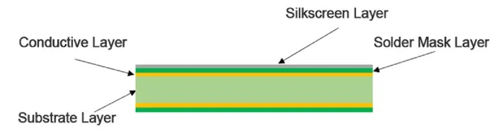
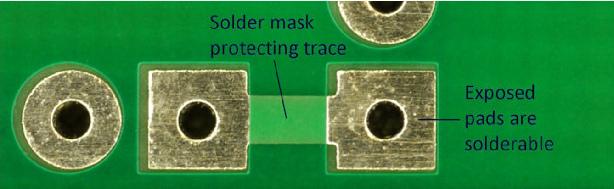
- Copper layer makes electrical connections between pads (called wires or traces)
- Solder mask layer insulates the traces
- Solder mask is removed from exposed pads
- Silkscreen for labeling and decoration

# Solder mask colors
- Usually green
- Also: blue, black
- Less common: red, white, yellow, purple, etc.

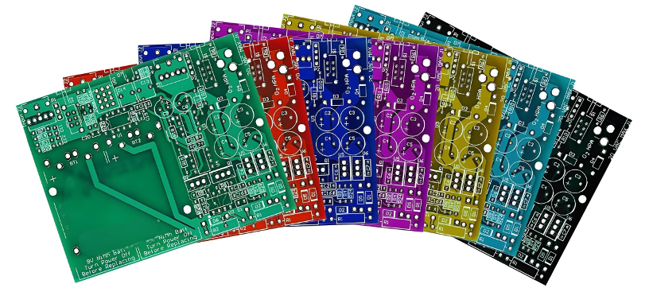

# Copper finish colors
Copper is coated to look silver or gold.

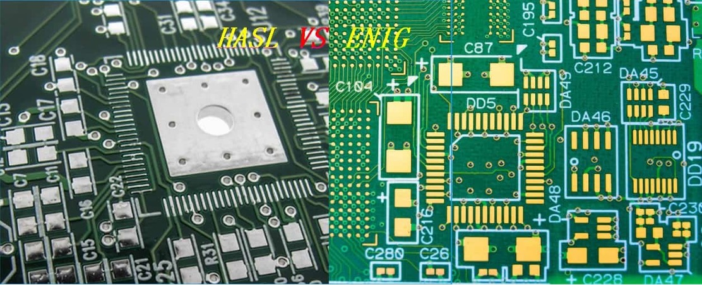

# Silkscreen is white
- Used for labeling components:
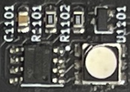

- Also used for text and graphics
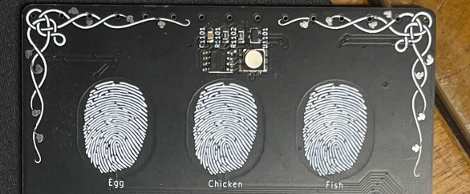

# Silkscreen is white 2

Used for labeling components:

Also used for text and graphics

# Layout design techniques
<!-- _class: lead -->
<!-- _paginate: false -->

# Old fashioned style

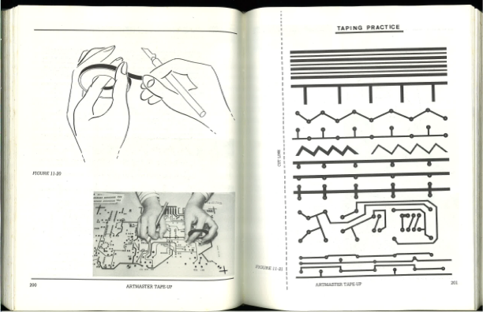

# Rubylith period

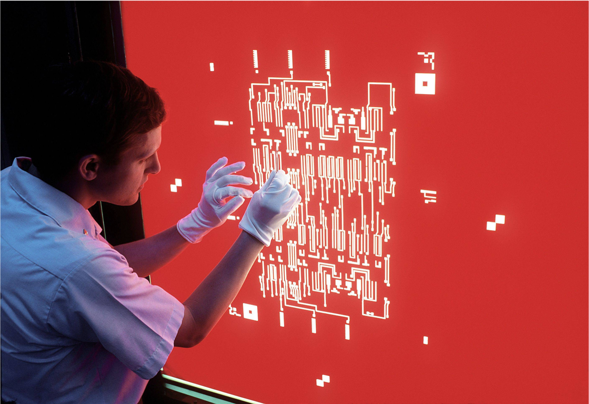

# Computer aided design (CAD)

# Computer aided design (CAD) 2

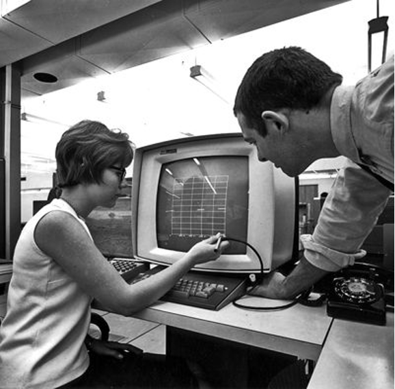
Mainframe CAD system
— IBM, Fairchild, 1967

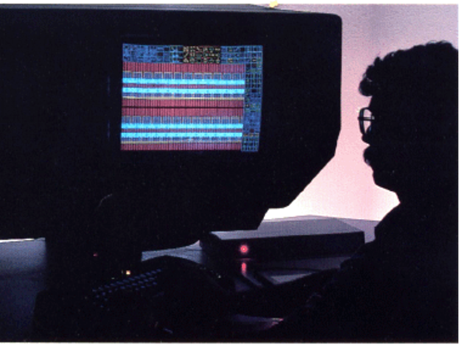
Calma Dimension III
— Calma Inc., 1985

# Modern computer aided design (CAD)

<!-- image: Altium Designer screenshot -->
<!-- image: KiCAD screenshot -->
<!-- image: additional modern CAD tool screenshot -->

Modern circuit + layout design:
- Commercial: Altium
- Open-source: KiCAD

# What does CAD enable

<!-- image: iPhone dissected — close-up of chip and PCB (© Alex Tait, 2019) -->

These CAD layout programs have revolutionized all of our electronic chips and boards — they allow for more complex circuitry per square mm.

iPhone dissected in 2019 (© Alex Tait)

# How asynchronous sessions will work

- Learn the procedure by reproducing the NYC RESISTOR example design
- Then repeat the procedure on your own design
- Each session, we start from checkpoint X, try to get to checkpoint X+1
- All the example checkpoint files are in the repo
- When you reproduce the example, move on to your own design or help others
- If you don't finish, no problem — you'll be able to catch up at the next checkpoint

# Asynchronous: Workflow 1: single-layer import into CAD

<!-- image: Inkscape SVG file open with artwork -->
<!-- image: KiCAD pcbnew with imported footprint -->

Follow the instructions in README.md — example first, then try your own.

# Vector graphics concepts

# Paths and nodes

<!-- image: Inkscape screenshot showing a path with anchor nodes highlighted -->
<!-- image: Inkscape screenshot showing anchor points on a path -->

- Each path is a closed shape
- They are defined by anchor nodes

# Grouping

<!-- image: Inkscape screenshot showing grouped paths moving together -->

A group is a set of multiple paths that move together.

# Layers in SVG

<!-- image: Inkscape layers panel screenshot -->

A layer is also a set of multiple paths, but different from a group. Layers typically don't move together. Layers give control over:
- Naming
- Hiding/Showing
- Ordering (what shows in front)
- Coloring

# SVG Layers for PCB design

<!-- image: SVG layer structure diagram (F.x / B.x layer naming) -->
<!-- image: PCB cross-section photograph for reference -->

- SVG layers correspond to PCB CAD layers
- F.x (front) / B.x (back)
- x.Cu = copper, so F.Cu = front copper
- x.Mask layers are inverted — shapes on Mask layers will be openings in the solder mask

# Editing vector graphics
<!-- _class: lead -->

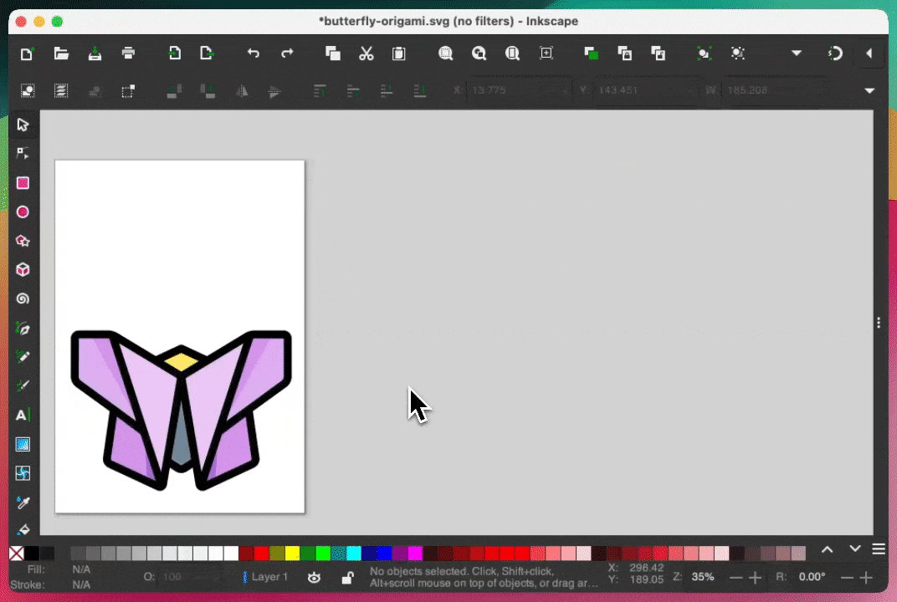

# Scale operations

<!-- image: Inkscape scale controls showing real units, relative units, and aspect ratio lock -->

Make things the right size — two techniques:
- Click and drag
- Enter scale numbers

Usually you want to lock the aspect ratio — hold Ctrl while dragging or click the lock button.

# Boolean operations

<!-- image: diagram illustrating Boolean union and intersection of two shapes, with labeled points -->

Boolean is a term from logic (True or False). In digital electronics: True = 5 V, False = 0 V. Operation: two things in, one thing out (A + B = C, A × B = D). In vector graphics, inputs and outputs are shapes; True = inside, False = outside.

- Intersection (AND): "Point 2 is inside shape A **and** inside shape B, so Point 2 is inside the output shape"
- Union (OR): "Point 2 is inside shape A **or** inside shape B, so Point 2 is inside the output shape"

# Boolean operations

Shape A / Shape B — Point 1 / Point 2

Repeat this logic for every point.

# Inset/outset operations

<!-- image: diagram comparing scale vs. outset vs. stroke-to-path operations on a shape -->

- Outset = expand the shape outwards — useful for generating outlines and overlaps
- Stroke to path = outset, then subtract inside to get outline

Scale → Outset → Stroke to path

# Recap: vector graphics editing

Concepts:
- Paths
- Nodes
- Groups
- Layers
- Path operations: Scale, Boolean (AND, OR, XOR), Inset/outset, Stroke to path

# Asynchronous: Workflow 2: Editing the logo

<!-- image: Inkscape screenshot showing NYCR logo editing workflow -->

- Start: NYCR-logo-phase-0-original.svg
- Milestone: NYCR-logo-phase-1.svg
- End: NYCR-logo-phase-2.svg

# Converting multi-layer graphics

<!-- image: decorative section graphic -->
<!-- image: NYC Resistor yin-yang logo (circular blue/green design) -->
<!-- image: yin-yang PCB artwork with dragon and tiger motif -->

# SVG Layers for PCB design

<!-- image: SVG layer naming diagram (F.x / B.x conventions) -->
<!-- image: Inkscape layers panel screenshot -->

- SVG layers correspond to PCB CAD layers
- F.x (front) / B.x (back)
- x.Cu = copper, so F.Cu = front copper
- Tips:
  - Shapes on Mask layers will be openings in the solder mask
  - Inkscape uses "SilkS", not "Silkscreen"
- From KiCAD ↔ From Inkscape

# Conversion step

<!-- image: terminal window running svg2mod command -->
<!-- image: svg2mod help output or usage example -->

- Use a terminal
- Install through pip
- Use `--h` option for help
- They do have an online hosted version, but it may not work reliably
- svg2mod.com

# Footprint libraries

<!-- image: KiCAD footprint library manager dialog -->

- pcbnew layouts contain references to footprints, not their entire geometry — we need to tell it where to find the files
- Make it project-specific — use a relative path (automatic)
- Our files are:
  - Library: `nycr-logo.pretty/`
  - Footprint: `NYCR-logo.kicad_mod`

# Placing the footprint

<!-- image: KiCAD pcbnew showing newly placed NYCR logo footprint -->

It should show up like this in the newly added library.

# Recap: from Inkscape to PCB design

1. Open Terminal
2. `pip install svg2mod`
3. Use svg2mod to convert
4. Add the footprint to a library
5. Place into board
6. Inspect in 3D
7. Add an outline on Edge.Cuts

# Asynchronous: Workflow 3: Converting and placing a footprint

<!-- image: svg2mod conversion command in terminal -->
<!-- image: KiCAD pcbnew with footprint placed and 3D view -->

- Start: NYCR-logo-phase-2.svg
- Milestone: NYCR-logo.kicad_mod
- End: NYCresistor-card-example2.kicad_pcb

# Uploading a PCB for fabrication

<!-- image: NYC Resistor yin-yang logo -->
<!-- image: PCB yin-yang artwork with dragon and panther motif -->

# Plotting gerbers

<!-- image: KiCAD File menu showing Plot (not Print) option -->

- Use **Plot** — do **not** use Print

# Plotting gerbers

<!-- image: KiCAD plot dialog with annotated settings -->

- Don't leave the output folder field blank
- Check that the correct layers are selected
- Deselect X2 format
- Deselect the extra options shown
- First click **Drill Files** and press OK in the new popup
- Finally, press **PLOT**

# Compressing to zip archive

<!-- image: file manager showing right-click context menu to compress/zip a folder -->

- Right click the gerbers folder
- Windows/Linux: google how to zip a directory

# Uploading to JLCPCB (similar for OSHPARK)

<!-- image: JLCPCB order page with drag-and-drop upload zone -->
<!-- image: JLCPCB upload confirmation or file drop in progress -->

Drag and drop the zip file.

# Inspect upload

<!-- image: JLCPCB Gerber viewer showing uploaded board outline and copper layers -->

# Configuring the physical properties

<!-- image: JLCPCB order configuration panel showing PCB properties -->

# Properties you can change

<!-- image: JLCPCB options panel — quantity, material, thickness, soldermask, finish -->
<!-- image: JLCPCB properties detail view -->

- Quantity
- Core Material
- PCB Thickness
- Soldermask Color
- Surface Finish
- (We will not need the rest of the properties)

# Recap: from PCB design to delivered boards

1. Starting in .kicad_pcb
2. Plot gerbers
3. Zip folder of gerbers
4. Drag-drop to JLCPCB or OSHPARK
5. Inspect upload
6. Checkout

# Offloads

# Our group order costs

Defaults (funded by the workshop ticket price):
- 5x qty
- Any color
- 1.6mm thickness
- Silver surface finish
- Fiberglass core

Add-ons (cost extra):
- Greater qty
- Gold surface finish
- Other thicknesses
- Aluminum or copper core

We're making add-ons available individually and at-cost.

**Process:**
1. Upload zip file
2. Select options → Calculated Price − $2.00
3. Shipping Estimate − $29.16
4. Venmo Resistor the remainder
5. Resistor pays JLCPCB

# Pricing add-ons: example 1

<!-- image: JLCPCB pricing calculator screenshot showing 30x qty, black mask, gold finish -->

Suppose I want 30x qty, black mask, gold finish:
- Boards: $51.20 − $2.00 = **$49.20**
- Excess shipping: $30.77 − $29.16 = **$1.61**
- I would Venmo Resistor: $49.20 + $1.61 = **$50.81** (on top of ticket price)

*Note: the numbers you get will differ based on board size.*

# Pricing add-ons: example 2

<!-- image: JLCPCB pricing calculator screenshot showing 100x qty, lead-free silver finish -->

Suppose I want 100x qty, lead-free silver finish:
- Boards: $50.40 − $2.00 = **$48.40**
- Excess shipping: $93.47 − $29.16 = **$64.31**
- I would Venmo Resistor: $48.40 + $64.31 = **$112.71**
- (Because 100x is significantly heavier than 5x)

*Note: the numbers you get will differ based on board size.*

# Raster import program (bitmap2component)

<!-- image: KiCAD bitmap2component dialog showing raster image import settings -->

# Raster import program

<!-- image: KiCAD bitmap2component output — raster converted to footprint -->