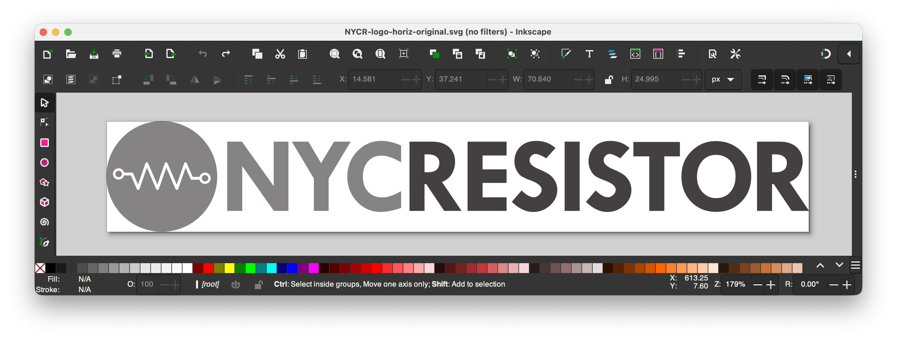
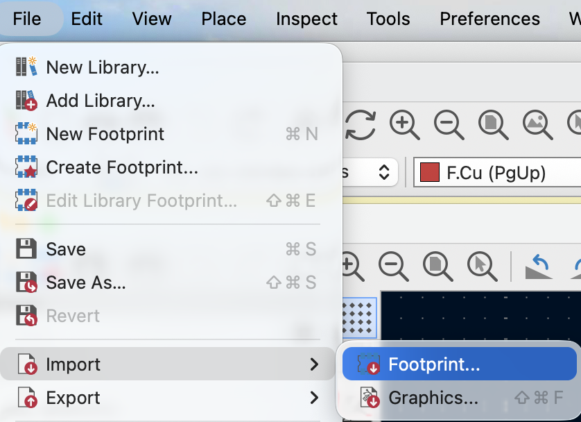
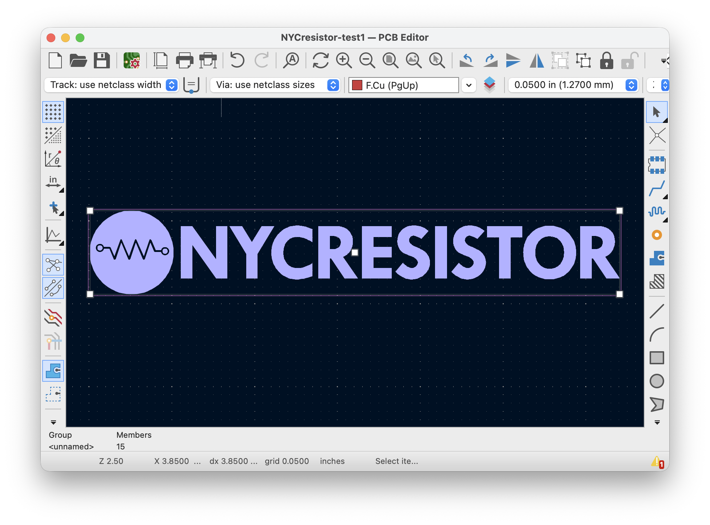
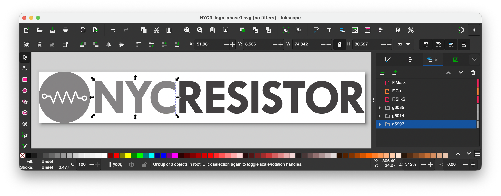
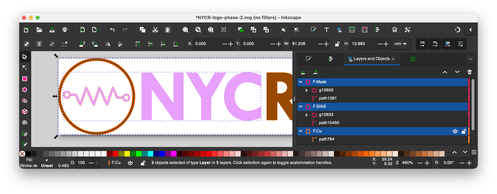
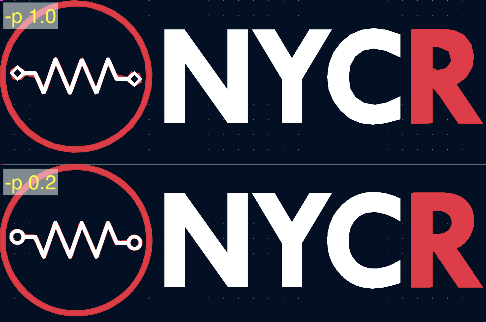
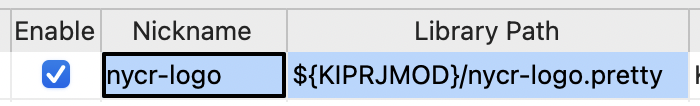
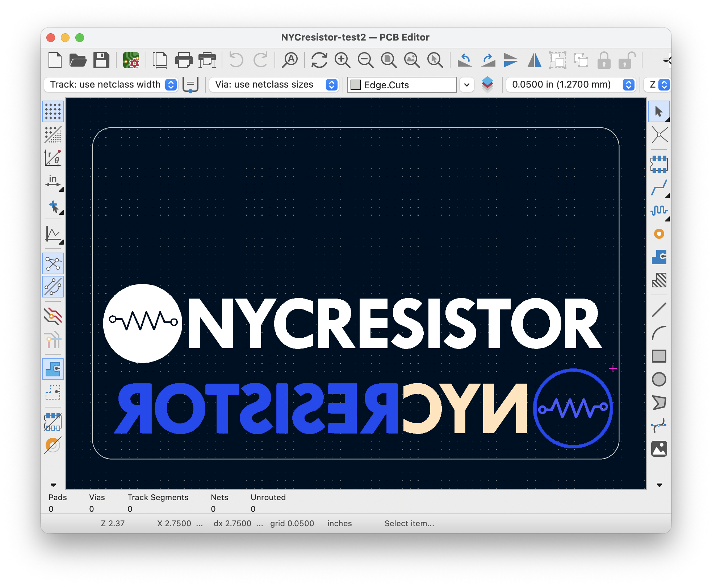

## Overview
This workshop will walk you through creating PCB artwork using Inkscape and KiCad.

There are three workflows:
1. Single-layer import style
2. Multi-layer footprint style
3. Placing a footprint from a library

These instructions trace the detailed procedure for the NYCR logo example. If you get stuck, checkpoint files are provided. That means you can skip steps and practice the techniques one step at a time.

When you repeat the procedure for your own graphics, you will not be able to skip steps.

This README contains the instructions for the three workflows. See the [Outline.md](Outline.md) file for the workshop outline.

## Obtain an SVG file
This example will use the NYCR logo. I found it by
- nycresistor.com
- drag-and-drop the logo to desktop
- It is already in SVG format!

You can repeat this process or use the checkpoint file included in the repo:

> 💾 Checkpoint: NYCR-logo-phase-0-original.svg


### To find your own SVG
Use google images and filter for Tools > Type > Line drawing.
Also try searching for "vector" "graphics" or "clip art".


## Layers of PCB that creates various appearances:

You can choose between gold, light, dark and white.

We will be naming the layers based on where they are going. So first we name F. (for the front) and then the ending is where that area is going (Cu, SilkS, or Mask).

All possible layers:
 - F.Cu
 - B.Cu
 - F.Mask
 - B.Mask
 - F.SilkS
 - B.SilkS

There are 3 design layers per side (F.Cu, F.Mask, and F.SilkS). That means 8 possible permutations of them—think of it like 8 corners on a cube.
- 2 of those permutations are invalid because silkscreen needs soldermask to stick
- 2 of those permutations are visually redundant because soldermask hides the copper underneath

That means 4 distinct appearances, covered in this table. FR4 is the base fiberglass material of the PCB.

| Appearance      | Physical stackup                         | SVG layers                |
| --------------- | ---------------------------------------- | ------------------------- |
| Light tan/brown | FR4                                      | F.Mask                    |
| Purple          | FR4 (+ copper) + soldermask              | None (+ F.Cu)             |
| Silver/gold     | FR4 + copper                             | F.Cu + F.Mask             |
| White           | FR4 (+ copper) + soldermask + silkscreen | F.SilkS (+ F.Cu)          |
| Invalid         |                                          | F.SilkS + F.Mask (+ F.Cu) |


## Workflow 1: Single-layer direct import
- In KiCad's `pcbnew` editor, create a new board. The file ends with `.kicad_pcb`.
- File > Import > Graphics > Select the SVG file



- Select the layer (F.Cu, F.Mask, etc.) and scale
- Move it around *and rescale*

> 💾 Checkpoint: NYCresistor-card-example1.kicad_pcb



## Workflow 2: Multi-layer footprint
### Pre-processing groups/layers in Inkscape
- Open NYCR logo in Inkscape
- Ungroup elements until letters are separate
- Regroup elements based on which letters go together
- Scale everything to desired size to fit on the board. You will not be abe to rescale after exporting the footprint.
- Create layers (F.Cu, F.Mask, F.SilkS)

> 💾 Checkpoint: NYCR-logo-phase-1.svg


Notice it *looks* the same so far, but now we have layers and more reasonable groupings.

### Editing steps
These are specific to the NYCR logo. You will need to adapt them to your own graphics.

Step 1: **NYC**: Single-layer silk screen
- Move "NYC" to `F.Silk` layer (Select elements, right click, Move to Layer...)
- Color the layer something (I used pink)

Step 2: **RESISTOR**: Metal multilayer
- Move "RESISTOR" to `F.Mask` layer.
- Color the layer something (I used brown)
- Then *duplicate* and move to `F.Cu` layer (make it orange)
- (optional, preferred) *outset* it to make it visible. (It is ok if the lines are not quite straight.)

Step 3: **Graphic**: Putting it together
- Use Stroke to Path for the resistor itself
- Move it to `F.Silk` layer.
- Duplicate and move to `F.Cu` layer.
- Change the color of the duplicate
- (optional, preferred) *outset* it to make it visible.
- With the outer circle, use your imagination. I used *subtraction* and *rescale* operations to put annuli on `F.Cu` and `F.Mask` layers.

> 💾 Checkpoint: NYCR-logo-phase-2.svg


## Workflow 3: From footprint to gerbers

### Convert SVG to KiCad module
- Download `svg2mod`
```
pip install svg2mod
```
[svg2mod Documentation](https://pypi.org/project/svg2mod/)

- Create a folder inside your wanted kicad folder called `somename.pretty`. It has to be in the kicad folder for kicad to find it
- Convert to kicad module
```
svg2mod -p 1.0 -o nycr-logo.pretty/NYCR-logo.kicad_mod nycr_logo.svg
```

If precision is too low, it will look jagged. Decrease the precision value (e.g., `-p 0.2`) to get a smoother curve. The lower this number, the larger the file size.



> 💾 Checkpoint: NYCR-logo.kicad_mod

### Import module into KiCad footprint manager
Edit footprint libraries: add nycr-logo.pretty


Confirm that it looks like this:



<!--
~~Next go into the footprint manager and import the module~~


Don't import the module, just copy it to the library folder. -->

### Add the footprint to the board
- Click "Place" button (hotkey: `A`)
- filter for "nyc"
- your footprint should appear in the list
- put it on the board somewhere


### Make the board outline
- In Kicad, select the outline layer (Edge.Cuts)
- Select the rectangle tool
- Pick a size (a credit card is 3.375" x 2.125")
- Right click, select "Fillet" and set the radius (a credit card has radius 0.125", about 3.2mm)

You can pick different dimensions. You can even use a circle. It's up to you. I recommend staying smaller than a credit card if you want to carry it around.

- ! Try flipping the footprint with "F" key. This is not possible with the direct import method.

> 💾 Checkpoint: NYCresistor-card-example2.kicad_pcb



### Preview in 3D viewer


- Practice moving the camera, play with raytracing, change board soldermask display color, etc.
- To change soldermask display color, go to File > Board Setup... > Physical Stackup


### Plot the gerbers
- Go to File > Plot
- Select these options
- Select the output directory "NameOfProject-tapeout"
- Click "Plot"


- Zip the gerber directory


## Instructions for ordering
### OSHPARK (United States)
- multiples of 3
- About $7 per board

1. Go to https://oshpark.com/
2. Drag and drop the gerber zip file into the window
3. Enter your email
4. Review each layer
5. Change options (defaults recommended)
6. Checkout (~$20 + free shipping)
7. Wait for delivery
8. Enjoy your new PCBs!

### JLCPCB (international - pay shipping)
This is cheaper, faster, with more options (color, thickness, etc.). It also scales better for larger quantities (~70¢ per board @ 50 boards). Most of the cost is in tariffs and shipping, so we are going to prefer OSHPARK for prototyping.

If you want to do a more advanced production run, see the slides for JLCPCB instructions, but I recommend starting with prototyping.