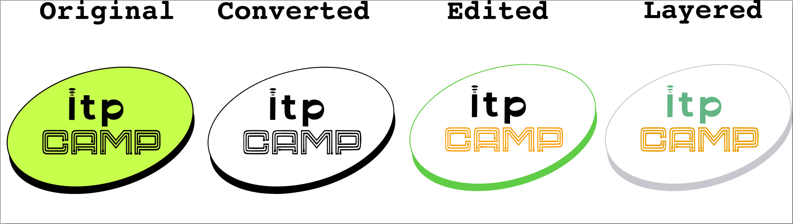
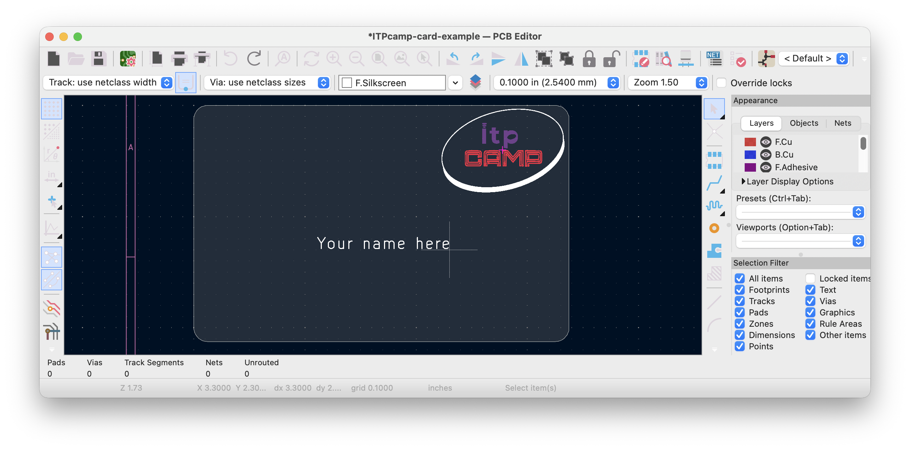
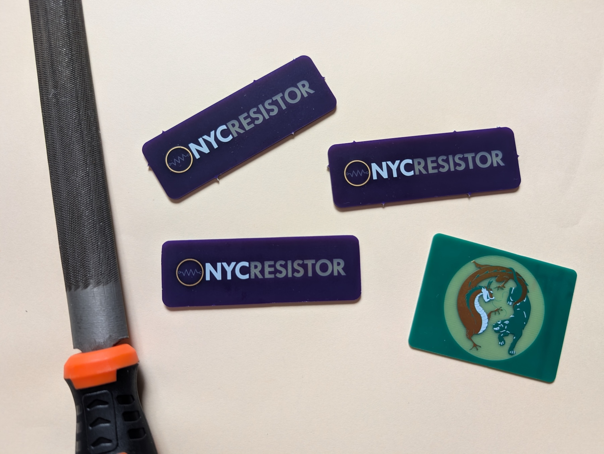

## Overview
This workshop will walk you through creating PCB artwork using Inkscape and KiCad.

There are three workflows:
1. Single-layer import style
2. Multi-layer footprint style
3. Placing a footprint from a library

These instructions trace the detailed procedure for the NYCR logo example. If you get stuck, checkpoint files are provided. That means you can skip steps and practice the techniques one step at a time.

Reproduce the steps with the example described here, then repeat the steps with your own graphics.

This README contains the instructions for the three workflows. See the [Outline.md](Outline.md) file for the workshop outline.

## Included examples
Look at these projects to see finished PCB artwork examples with the `svg2mod` workflow (Workflow 3). See "SVG editing" directories for source files. See ".pretty" directories for footprint files.
- `Example-ITP-camp-card`
- `Example-NYCR-logo-card`
- `Example-Palette`
- `Example-Zoo`

## Obtaining or creating an SVG file
This example will use the NYCR logo. I found it by
- nycresistor.com
- drag-and-drop the logo to desktop
- It is already in SVG format!

You can repeat this process or use the checkpoint file included in the repo:

> 💾 Checkpoint: NYCR-logo-phase-0.svg


### To find your own SVG
Use duckduckgo images and filter for Tools > Type > Line drawing.
Also try searching for "vector" "graphics" or "clip art".


Or search for "free vector art" and find sites like vecteezy.com

Or create your own SVG by hand.

Or use a bitmap photo (PNG, JPG) and trace it in Inkscape.

## Layers of PCB that creates various appearances:

PCBs will either be purple or green depending on how you order them. FR4 is the base fiberglass material of the PCB. You can choose between 4 different colors to make your art: gold, light (tan or brownish), dark (green or purple), and white.

Layers are named based on side of board and material the shapes represent. So first we name F (for the front of the board) and then the ending is where that area is going (Cu, SilkS, or Mask). B is for Back.

All possible layers:
 - F.Cu
 - B.Cu
 - F.Mask
 - B.Mask
 - F.SilkS
 - B.SilkS
 - Edge.Cuts (board cutouts)

There are 3 design layers per side (F.Cu, F.Mask, and F.SilkS). That means 8 possible permutations of them—think of it like 8 corners on a cube.
- 2 of those permutations are invalid because silkscreen needs soldermask to stick
- 2 of those permutations are visually redundant because soldermask hides the copper underneath

That means 4 distinct appearances, covered in this table.

| Appearance on board  | Appearance on kicad render | Physical stackup              | SVG layers                |
| -------------------- | -------------------------- | ----------------------------- | ------------------------- |
| Tan or brown         | Brown                      | FR4                           | F.Mask                    |
| Green or purple      | Green                      | FR4 + soldermask              | None or F.Cu alone        |
| Silver or gold       | Yellow                     | FR4 + copper                  | F.Cu + F.Mask             |
| White                | White                      | FR4 + soldermask + silkscreen | F.SilkS                   |
| Invalid              | Invisible                  | FR4 + silkscreen (silkscreen needs soldermask to stick) | F.SilkS + F.Mask |


Edge.Cuts is a separate mechanical layer for board outlines and cutouts. It doesn't participate in the visual layer permutations but can be used creatively for internal cutouts, slots, and expressive board shapes.

### Translucency
While there are four primary appearances, it is possible to modify them slightly. For example, putting B.Mask and F.Mask together creates a translucent brown effect (light shines through the board); putting B.Cu and F.Mask together creates an opaque brown effect.

Having F.Cu on its own results in copper beneath the soldermask, which is very slightly lighter than having dark soldermask without copper (no layers). The table puts both in the same row.

## Workflow 1: Single-layer direct import
- In KiCad's `pcbnew` editor, create a new board. The file ends with `.kicad_pcb`.
- File > Import > Graphics > Select the SVG file


- Select the layer (F.Cu, F.Mask, etc.) and scale
- Move it around *and rescale*

> 💾 Checkpoint: NYCresistor-card-example1.kicad_pcb


## Workflow 2: Multi-layer footprint
### Pre-processing groups/layers in Inkscape
- Open NYCR logo in Inkscape
- Ungroup elements until letters are separate
- Regroup elements based on which letters go together
- Scale everything to desired size to fit on the board. You will not be abe to rescale after exporting the footprint.
- Create layers (F.Cu, F.Mask, F.SilkS)

> 💾 Checkpoint: NYCR-logo-phase-1.svg


Notice it *looks* the same so far, but now we have layers and more reasonable groupings.

### Editing steps for NYCR logo
These are specific to the NYCR logo. You will need to adapt them to your own graphics.

Step 1: **NYC**: Single-layer silk screen
- Move "NYC" to `F.SilkS` layer (Select elements, right click, Move to Layer...)
- Color the layer something (I used pink)

Step 2: **RESISTOR**: Metal multilayer
- Move "RESISTOR" to `F.Mask` layer.
- Color the layer something (I used brown)
- Then *duplicate* and move to `F.Cu` layer (make it orange)

Step 3: **Graphic**: Putting it together
- Use Stroke to Path for the resistor itself
- Move it to `F.SilkS` layer.
- Duplicate and move to `F.Cu` layer.
- Change the color of the duplicate
- With the outer circle, use your imagination. I used *subtraction* and *rescale* operations to put annuli on `F.Cu` and `F.Mask` layers.

> 💾 Checkpoint: NYCR-logo-phase-2.svg


### Other editing tips
See ITPcamp example for a side-by-side workflow. Instead of multiple files (phase 0, phase 1, etc.), I kept everything in one file and used layers to organize the work.



**Original**: The PNG I pulled from the internet

**Converted**: Tracing the PNG based on brightness threshold. It is a single compound path.

**Edited**: The path was *decomposed* and then pieces were recomposed to make sense. E.g. the outer ellipse as one path; "ITP" as another path; and "camp" as another path.

**Layered**: The final design with layers organized on F.Cu, F.Mask, and F.SilkS. While converting, everything else not on these layers will be ignored.



## Workflow 3: From footprint to gerbers

### Convert SVG to KiCad module (Terminal version)
*It is recommended to use the GUI version below, but the terminal version is also available.*

Install `svg2mod`
```
pip install svg2mod
```
[svg2mod Documentation](https://pypi.org/project/svg2mod/)

- Create a folder inside your wanted kicad folder called `somename.pretty`. It has to be in the kicad folder for kicad to find it
- Convert to kicad module
```
svg2mod -p 1.0 -o nycr-logo.pretty/NYCR-logo.kicad_mod nycr_logo.svg
```

If precision is too low, it will look jagged. Decrease the precision value (e.g., `-p 0.2`) to get a smoother curve. The lower this number, the larger the file size.


> 💾 Checkpoint: NYCR-logo.kicad_mod

### Convert SVG to KiCad module (GUI version)
Use this web app to run the svg2mod command in your browser:
https://taitphotonlab.com/projects/svg2kicad.html

1. Drag and drop your SVG file (.svg)
2. Adjust precision setting (default is usually fine)
3. Convert
4. Download the generated KiCad module (.kicad_mod)

Note that svg2mod.com exists to do the same thing, but it is not currently working.

### Import module into KiCad footprint manager
Edit footprint libraries: add nycr-logo.pretty


Confirm that it looks like this:


<!--
~~Next go into the footprint manager and import the module~~


Don't import the module, just copy it to the library folder. -->

### Add the footprint to the board
- Click "Place" button (hotkey: `A`)
- filter for "nyc"
- your footprint should appear in the list
- put it on the board somewhere


- ! Try flipping the footprint with "F" key. This is not possible with the direct import method.

### Make the board outline
- In Kicad, select the outline layer (Edge.Cuts)
- Select the rectangle tool
- Pick a size (a credit card is 3.375" x 2.125")
- Right click, select "Fillet" and set the radius (a credit card has radius 0.125", about 3.2mm)

You can pick different dimensions, big or small. You can even use a circle. You can embed Edge.Cuts into the SVG. It's up to you. I recommend staying smaller than a credit card if you want to carry it around.

> 💾 Checkpoint: NYCresistor-card-example2.kicad_pcb


### Preview in 3D viewer


- Practice moving the camera, play with raytracing, change board soldermask display color, etc.
- To change soldermask display color, go to File > Board Setup... > Physical Stackup


### Plot the gerbers
- Go to File > Plot
- Select these options
- Select the output directory "NameOfProject-tapeout"
- Click "Plot"


- Zip the gerber directory


## Iterating on the design

If you want to make changes to your artwork after creating the footprint:

1. Make changes in Inkscape
2. Save the SVG file
3. Run the svg2mod command again. Make sure the output path is pointing to the live library:
   ```
   svg2mod -p 1.0 -o nycr-logo.pretty/NYCR-logo.kicad_mod nycr_logo.svg
   ```
4. Quit and reopen `pcbnew.app` (KiCad needs to reload the library)
5. Add component (hotkey: `A`), find your library, and place the updated footprint
6. 3D view (hotkey: `Opt-3`) will show you how it looks in real life.
7. Review the 3D model and make further adjustments in Inkscape

## Instructions for ordering
### OSHPARK (United States)
- multiples of 3
- About $7 per board

1. Go to https://oshpark.com/
2. Drag and drop the gerber zip file into the window
3. Enter your email
4. Review each layer
5. Change options (defaults recommended)
6. Checkout (~$20 + free shipping)
7. Wait for delivery
8. Enjoy your new PCBs!

### JLCPCB (international - pay shipping)
This is cheaper, faster, with more options (color, thickness, etc.). It also scales better for larger quantities (~70¢ per board @ 50 boards). Most of the cost is in tariffs and shipping, so we are going to prefer OSHPARK for prototyping.

If you want to do a more advanced production run, see the slides for JLCPCB instructions, but I recommend starting with prototyping.

## After you get your board:
It may have spiky edges or burrs on the board from the machines that cut them out. You can file these off with a metal file but make sure to have the board be wet when you are doing this as the filing will great fiberglass dust and you don't want that to go into your lungs or skin.

